# Computer Graphics – Shader Pipeline

> **To get started:** Clone this repository and all its [submodule](https://git-scm.com/book/en/v2/Git-Tools-Submodules) dependencies using:
> 
>     git clone --recursive https://github.com/alecjacobson/computer-graphics-shader-pipeline.git

**Do not fork:** Clicking "Fork" will create a _public_ repository. If you'd like to use GitHub while you work on your assignment, then mirror this repo as a new _private_ repository: https://stackoverflow.com/questions/10065526/github-how-to-make-a-fork-of-public-repository-private

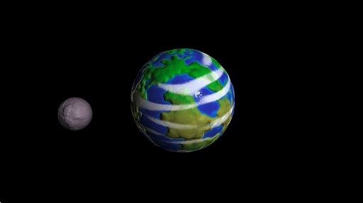

## Background

> ### Review chapters 6, 7 and sections 8.1-8.2 of _Fundamentals of Computer Graphics (4th Edition)_.

### Read Sections 11.4-11.5 and Chapter 17  of _Fundamentals of Computer Graphics (4th Edition)_.

In this assignment, we will use the "real-time rendering" shader pipeline and
procedural rendering to create interesting pictures.

### GLSL

Your work will be implemented using the [OpenGL shading language
(glsl)](https://en.wikipedia.org/wiki/OpenGL_Shading_Language). In many ways,
glsl code looks like C++ code. However, there are many builtin linear algebra
types (e.g., `vec3` is a 3D-vector type) and geometric functions (e.g.,
`dot(a,b)` computes the [dot product](https://en.wikipedia.org/wiki/Dot_product)
between vectors `a` and `b`. Since vectors are often used to represent spatial
coordinates _or_ colors. We can index the coordinates of a vector (`vec3 a`)
using `a.r`, `a.g`, `a.b` or `a.x`, `a.y`, `a.z`. When working with [perspective
projection](https://en.wikipedia.org/wiki/3D_projection#Perspective_projection)
it's often useful to employ 4D [homogeneous
coordinates](https://en.wikipedia.org/wiki/Homogeneous_coordinates) vectors:
`vec4` in glsl. Glsl has many builtin ways to work with differently sized
vectors and matrices. For example, if we have `vec4 h` then we can write `vec3 p
= h.xyz;` to grab the first three coordinates. Similarly, we could write: `vec4
h = vec4(p,1.0)` to convert a 3D Cartesian point to a 4D homogeneous point.

Fortunately, there are many online resources and googling a glsl-related
question often returns helpful answers.

### On the CPU side

The shaders you write in this assignment will run on the
[GPU](https://en.wikipedia.org/wiki/Graphics_processing_unit). Let's breifly
describe what's happening on the
[CPU](https://en.wikipedia.org/wiki/Central_processing_unit) side.

A pseudo-code version of `main.cpp` might look like:

```
main()
  initialize window
  copy mesh vertex positions V and face indices F to GPU
  while window is open
    if shaders have not been compiled or files have changed 
      compile shaders and send to GPU
    send "uniform" data to GPU
    set all pixels to background color
    tell GPU to draw mesh
    sleep a few milliseconds
```

#### Window

Creating a window is clearly something that will depend on the operating system
(e.g., Mac OS X, Linux, Windows). This assignment, like many small scale
graphics programs or games, uses an open source windowing toolkit called
[glfw](https://en.wikipedia.org/wiki/GLFW). It works on all major operating
systems. Once the window is open we have access to its contents as an RGB image.
The job of our programs are to fill in all the pixels of this image with colors.
The windowing toolkit also handles interactions with the mouse and keyboard as
well as window resizing.

#### Shader compilation

Unlike your C++ code, shaders are compiled _at runtime_. This has a nice
advantage that you can change your shaders without restarting the main program.
So long as the change is noticed and the shaders are recompiled, the rendering
will be immediately updated.

Compilation errors (usually syntax errors) will be output from the main program
and the window will turn black (background color). For example, if your
_fragment shader_ contained:

```
#version 410 core
in vec3 pos_fs_in;
out vec3 color;
void main()
{
  color = pos_fs_in.x;
}
```

You would see an error printed to the screen:

```
ERROR: failed to compile fragment shader
ERROR: 0:6: Incompatible types (vec3 and float) in assignment (and no available implicit conversion)

ERROR: One or more attached shaders not successfully compiled

ERROR: Failed to link shader program
```

If you change this file, the main program should immediately notice the change
before drawing the next frame. If successful there will be no error message and
the screen may now draw something interesting.

#### Data on the GPU

From the perspective of the shader pipeline, data on the GPU is separated into
different types. For example, when we send the mesh vertex positions to the GPU
we're associating one 3D position _per vertex_. This data is considered an
"attribute" of each vertex. Each vertex invokes a single execution of the vertex
shader and its corresponding position is given as the `in vec3 pos_vs_in;`
variable. The output of the vertex shader will be "varying" depending on the
input and computation conducted. Your program is responsible for setting this
output value in `out vec3 pos_cs_in`. This variable is named ending with
`_cs_in` because it will in turn be used as input to the next shader in the
pipeline _tessellation control shader_.

Small amounts of data that is constant and independent of the particular
vertex/tessellation patch/fragment being processed is labeled as "uniform" data.
The prototypical example of this is the perspective projection matrix: `uniform
mat4 proj`. Uniform data is usually changed once per draw frame (e.g., `uniform
float time_since_start` is updated with the number of seconds since the start of
the program) or once per "object" (e.g., `uniform bool is_moon;` is set based on
whether we're drawing the first or second object in our scene).

Large amounts of data that may be randomly accessed by shaders is stored in
"texture" memory (e.g., color texture images). This data must be accessed by
sampling specific pixel values based on a given 2D locations (e.g., the U.V.
mapping of a fragment).

### Tessellation Control Shader

The tessellation control shader determines how to subdivide each input "patch"
(i.e., triangle). Unlike the subdivision we saw with [subdivision
surfaces](https://en.wikipedia.org/wiki/Subdivision_surface), the subdivision is
determined independently for each triangle and _not_ called recursively.
The exact pattern of the resulting triangulation is left largely to
implementation. As the shader programmer, you have control over:

  - the number of new edges each input each should split into
    (`gl_TessLevelOuter[1] = 5` means the edge across from vertex `1` (i.e., the
    edge between vertices `0` and `2`) should be split into 5 edges); and
  - the number of edges to place toward the center of the patch
    (`gl_TessLevelInner[0] = 5` would be a good choice if
    `gl_TessLevelOuter[...] = 5` and a regular tessellation was desired).

Unlike the vertex or fragment shader, the tessellation control shader has access
to attribute information at _all_ of the vertices of a triangle. The main
responsibility of this shader is setting the `gl_TessLevelOuter` and
`gl_TessLevelInner` variables.

> **Question:** If the amount of subdivision along each edge is determined
> independently for each triangle, how can we make sure neighboring triangles
> subdivide their shared edge the same amount?
>
> **Hint:** ✌️
>

### Tessellation Evaluation Shader

The tessellation _evaluation_ shader takes the result of the tessellation that
the tessellation _control_ shader has specified. This shader is called once for
every vertex output during tessellation (including original corners). It has
access to the attribute information of the original corners (e.g., in our code
`in vec3 pos_es_in[]`) and a special variable `gl_TessCoord` containing the
[barycentric
coordinates](https://en.wikipedia.org/wiki/Barycentric_coordinate_system) of the
current vertex. Using this information, it is possible to interpolate
information stored at the original corners onto the current vertex: for example,
the 3D position. Like the vertex and tessellation control shader, this shader
can change the 3D position of a vertex. This is the _last opportunity_ to do
that, since the fragment shader cannot.

### How come I can't use `#include`?

Our glsl shader programs are not compiled from files. Instead the
CPU-side program must read the file contents into memory as strings and provide
the raw strings to the shader compiler. Unfortunately, this means there is no
`#include` preprocessor directive and sharing code across different shaders is a
burden.

In this assignment, we will use a `.json` file to collect the different files
whose contents are _**concatenated**_ to form the input string to be compiled
for each shader. For example, in `data/test-01.json` you'll see:

```
{
  "vertex": [ "../src/version410.glsl","../src/pass-through.vs"],
  "tess_control": [ "../src/version410.glsl","../src/pass-through.tcs"],
  "tess_evaluation": [ "../src/version410.glsl","../src/pass-through.tes"],
  "fragment": [ "../src/version410.glsl","../src/pass-through.fs"]
}
```

This indicates that the string for the vertex shader is the concatenation of two
(2) files `../src/version410.glsl` and then `"../src/pass-through.vs"`.
Similarly, for each of the other shaders.

### Shader debugging

Debugging shader programs must be done visually. Since we only see the result of
_all_ computation, we can use the shader pipeline's ability to set screen colors
to debug _all_ computation simultaneously. For example, when debugging the
fragment shader we can check all values at once by setting the pixel color to a
value we expect (or don't expect) depending on the computation. A few useful
commands come in handy:

`color = 0.5+0.5*n;` will set the color based on the normal.

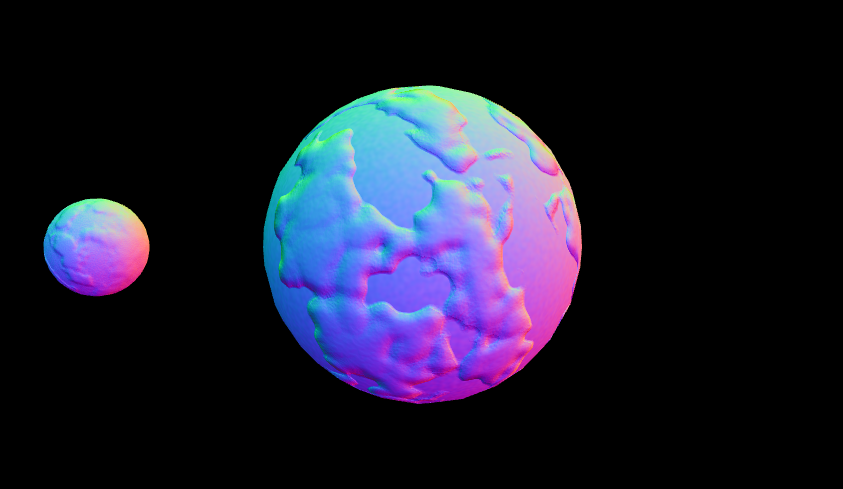

`color = vec3(0.5,0.5,0)+vec3(0.5,0.5,0)*view_pos_fs_in.xyz` will set the color based on the 2D position.

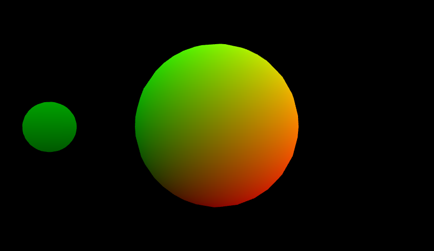

`color = (1+(view_pos_fs_in.z - -3)/5)*vec3(1,1,1);` will set the color based on
the distance to the camera in the z-direction.

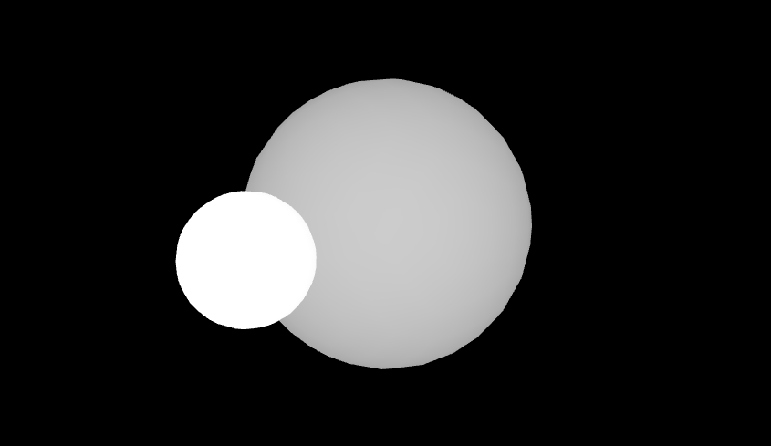

`color = vec3(float(is_moon),1,0);` will set the color to yellow or green based
on a boolean value (in this case `is_moon`).

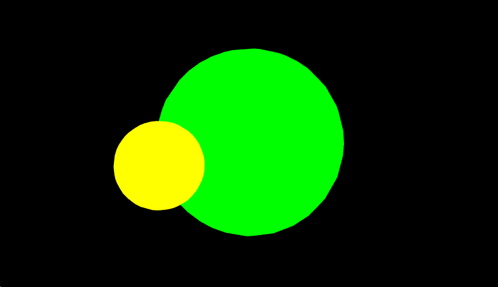

## Bump and normal maps

A **bump map** is a mapping from a surface point to a displacement along the
normal direction. A **normal map** is a mapping from a surface point to a unit
normal vector. In a mathematical sense, a normal map is non-sense. A point on a
surface has a specific normal completely determined by its local geometry. The
normal is the direction that goes in the _most outward_ direction from the
surface. That is, the normal is perpendicular to the surface. Since a surface
is two dimensional, the directions that _stay on_ the surface are spanned by a
two dimensional _tangent plane_.

Normal mapping is useful in computer graphics because we can drape the
appearance of a complex surface on top a low resolution and simple one. To
create a consistent and believable looking normal map, we can first generate a
plausible bump map. Each point $\mathbf{p}∈ \mathbb{R}³$ on the surface is moved to a new
position $\mathbf{\tilde{p}} ∈ \mathbb{R}³$:

\\[
\mathbf{\tilde{p}}(\mathbf{p}) := \mathbf{p} + h(\mathbf{p}) \ \mathbf{\hat{n}}(\mathbf{p}) ,
\\]
where $h : \mathbb{R}³ → \mathbb{R}$ is the bump height amount function (could
be negative) and $\mathbf{\hat{n}}(\mathbf{p}) : \mathbb{R}³ → \mathbb{R}³$ is the
_mathematically_ correct normal at $\mathbf{p}$.

If our bump height $h$ is a smooth function over the surface, we can compute the
_perceived_ normal vector $\mathbf{\tilde{n}}$ by taking a small [finite
difference](https://en.wikipedia.org/wiki/Finite_difference) of the 3D position:

\\[
\mathbf{\tilde{n}} = \frac{∂\ \mathbf{p}}{∂\ \mathbf{T}} ×
\frac{∂\ \mathbf{p}}{∂\ \mathbf{B}} ≈ 
\left(\frac{\mathbf{\tilde{p}(\mathbf{p} + ε \mathbf{T}})-\mathbf{\tilde{p}}(\mathbf{p})}{ε}\right) ×
\left(\frac{\mathbf{\tilde{p}(\mathbf{p} + ε \mathbf{B}})-\mathbf{\tilde{p}}(\mathbf{p})}{ε}\right)
\\]
where $\mathbf{T},\mathbf{B}∈ \mathbb{R}³$ are orthogonal [tangent and
bi-tangent vectors](https://en.wikipedia.org/wiki/Tangent_vector) in the tangent
plane at $\mathbf{p}$ and $ε$ is a small number (e.g., `0.0001`). By abuse of
notation, we'll make sure that this approximate perceived normal is unit length
by dividing by its length:

\\[
\mathbf{\tilde{n}} ←
\frac{\mathbf{\tilde{n}}}{‖\mathbf{\tilde{n}}‖}.
\\]

> **Question:** Can we always recover _some_ orthogonal tangent vectors $\mathbf{T}$ and $\mathbf{B}$ from
> the unit normal 
> $\mathbf{n}$ ?
>
> **Hint:** ☝️
>

## Tasks

There are no [header files](https://stackoverflow.com/a/19709740/148668).
Accordingly, this assignment is organized a bit differently. The `src/`
directory contains glsl files whose contents should be completed or replaced.
Some of the functions have an element of creative freedom (e.g.,
`src/bump_position.glsl`), while others are have a well-defined specification
(e.g., `src/identity.glsl`).

Since glsl does not support `#include`, the comments may hint that a previously
defined function can/should/must be used by writing `// expects: ...`.

You may check the corresponding `.json` example file to see specifically which
glsl files are loaded (and in which order) for each test program.

Unless otherwise noted, _**do not declare new functions**_. 

### White list

  - [`mix`](https://www.khronos.org/registry/OpenGL-Refpages/gl4/html/mix.xhtml)
  - [`normalize`](https://www.khronos.org/registry/OpenGL-Refpages/gl4/html/normalize.xhtml)
  - [`length`](https://www.khronos.org/registry/OpenGL-Refpages/gl4/html/length.xhtml)
  - [`clamp`](https://www.khronos.org/registry/OpenGL-Refpages/gl4/html/clamp.xhtml)
  - [`sin`](https://www.khronos.org/registry/OpenGL-Refpages/gl4/html/sin.xhtml)
  - [`cos`](https://www.khronos.org/registry/OpenGL-Refpages/gl4/html/cos.xhtml)
  - [`abs`](https://www.khronos.org/registry/OpenGL-Refpages/gl4/html/abs.xhtml)
  - [`pow`](https://www.khronos.org/registry/OpenGL-Refpages/gl4/html/pow.xhtml)

### Black list
 
  - `noise1`
  - `noise2`
  - `noise3`
  - `noise4`

This assignment works best if you implement the following tasks _in order_.

Before editing anything be sure that your opengl and shader setup is correct. If you run `./shaderpipeline ../data/test-01.json` you should see this
image: 

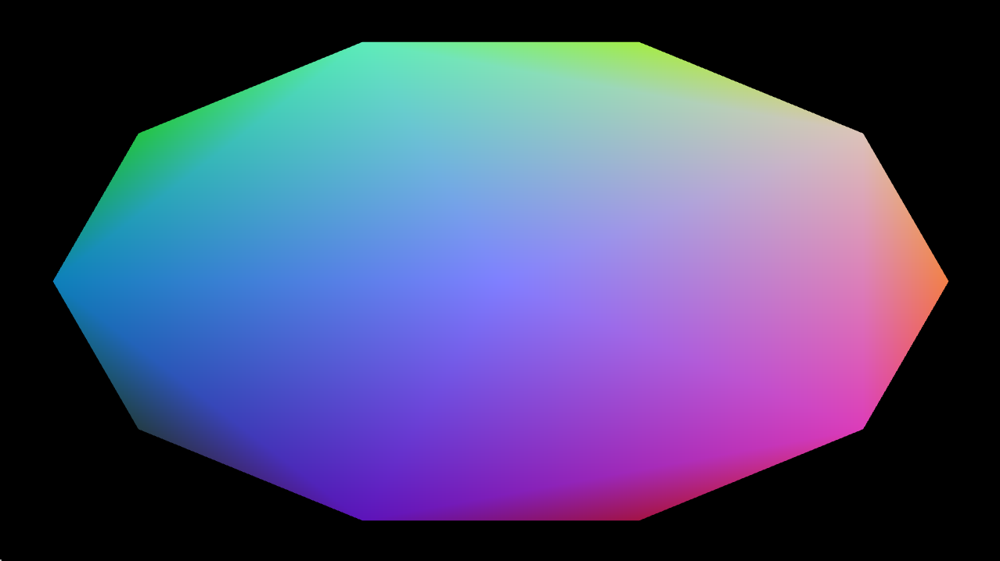


### `src/identity.glsl`

### `src/uniform_scale.glsl`

### `src/translate.glsl`

### `src/rotate_about_y.glsl`

### `src/model.glsl`

### `src/model_view_projection.vs`

### `src/blue_and_gray.fs`

With these implemented you should now be able to run `./shaderpipeline
../data/test-02.json` and see an animation of a gray moon orbiting around a blue
planet: 

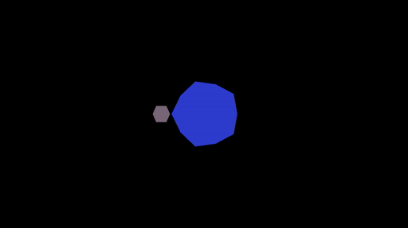

If you press `L` this should switch to a [wireframe]() rendering:

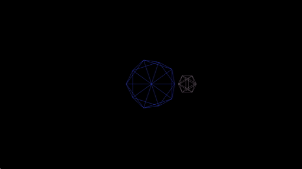

### `src/5.tcs`

Running `./shaderpipeline ../data/test-03.json` and pressing `L` should produce an
animation of a gray moon orbiting around a blue planet in wireframe with more
triangles: 

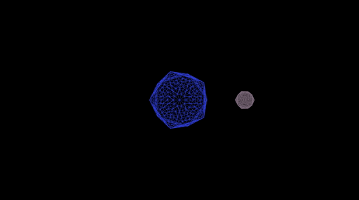

### `snap_to_sphere.tes`

Move your model-view-projection operations from the vertex shader (e.g.,
`model_view_projection.vs`) to the tessellation evaluation shader. In addition,
snap the vertices of each shape to the unit sphere before applying these
transformations. This gives your shapes a round appearance if you run
`./shaderpipeline ../data/test-04.json`: 

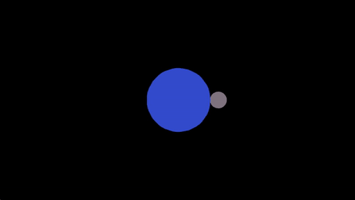

### `blinn_phong.glsl`

### `lit.fs`

Running `./shaderpipeline ../data/test-05.json` adds light to the scene and we
see a smooth appearance with specular highlights: 

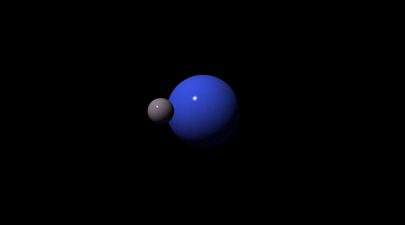

### `random_direction.glsl`

### `smooth_step.glsl`

### `perlin_noise.glsl`

### `procedural_color.glsl`

Be creative! Your procedural colored shape does not need to look like marble
specifically and does not need to match the example. Mix and match different
noise frequencies and use [function
composition](https://en.wikipedia.org/wiki/Function_composition) to create an
interesting, complex pattern.

Running `./shaderpipeline ../data/test-06.json` adds a procedural _color_ to the
objects. The color should _**not**_ change based on the view or model
transformation. For example, this animation attempts to recreate a
[marble](https://en.wikipedia.org/wiki/Marble) texture: 

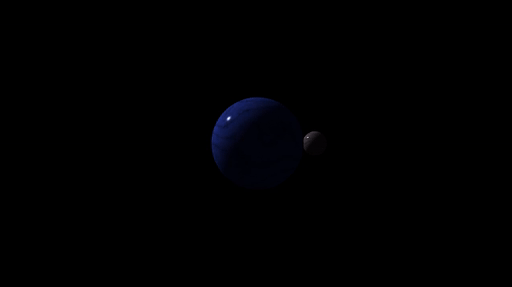

### `improved_smooth_step.glsl`

### `improved_perlin_noise.glsl`

### `bump_height.glsl`

### `bump_position.glsl`

### `bump.fs`

Be creative! Your bumpy shape does not need to match the example.

Running `./shaderpipeline ../data/test-07.json` adds a [normal
map](https://en.wikipedia.org/wiki/Normal_mapping) determined by differentiating
a procedural [bump map](https://en.wikipedia.org/wiki/Bump_mapping). The color
should _**not**_ change based on the view or model transformation. For example,
this animation attempts to recreate the (very) bumpy appearance of planets and
moons: 

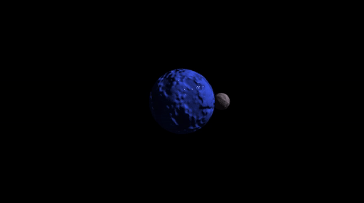

For this file, you _**may**_ declare new functions: declare them directly at the
top of `bump.fs`; do not modify the .json files.

### `planet.fs`

For this file, you _**may**_ declare new functions: declare them directly at the
top of `planet.fs`; do not modify the .json files.

Be creative! Your planets do not need to look like the earth/moon and do not
need to look like the example planets.

> **Hint:** Sprinkle noise on _everything_: diffuse color, specular color,
> normals, specular exponents, color over time.

Running `./shaderpipeline ../data/test-08.json` should display a creative planet
scene. For example: 

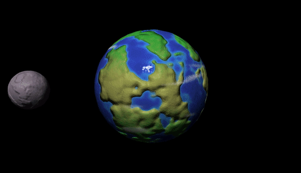
